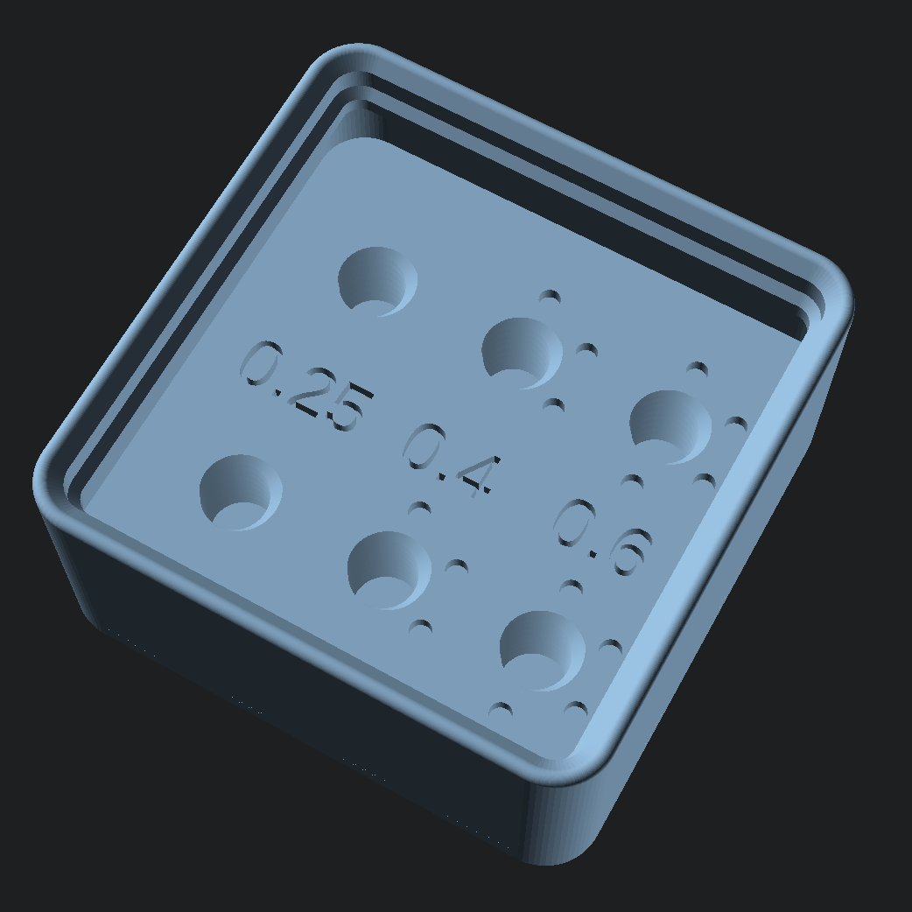
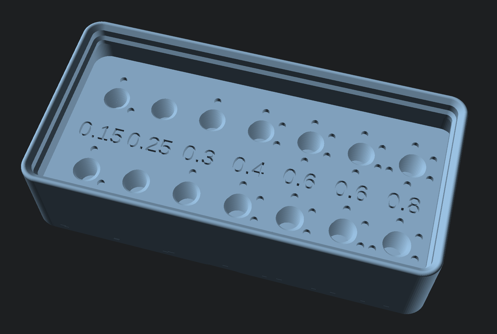
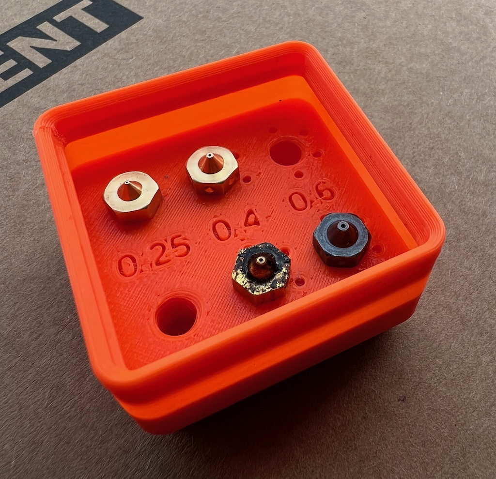

[![CC BY-NC-SA 4.0][cc-by-nc-sa-shield]][cc-by-nc-sa]

[cc-by-nc-sa]: http://creativecommons.org/licenses/by-nc-sa/4.0/
[cc-by-nc-sa-shield]: https://img.shields.io/badge/License-CC%20BY--NC--SA%204.0-lightgrey.svg

# OpenSCAD Gridfinity Nozzle Holder

This is an [OpenSCAD][] [Gridfinity][] nozzle holder, designed to be easily customised.

[OpenSCAD]: https://openscad.org/
[Gridfinity]: https://www.youtube.com/watch?v=ra_9zU-mnl8

Features:

 - Threaded M6 holes to hold the nozzles
 - Text labels
 - Dot codes around the nozzle holes
 - Designed for V6 nozzles, but could be adapted for others
 - Stackable

Two examples are provided:

 - [`nozzle-holder-1x1.scad`](nozzle-holder-1x1.scad)
   
 - [`nozzle-holder-2x1.scad`](nozzle-holder-2x1.scad)
   

An example print of `nozzle-holder-1x1.scad`, printed on a Prusa Mini with 0.4mm nozzle at 0.2mm layer heights with Prusa Orange PLA:

As per [gridfinity-rebuilt-openscad][], please use a build of [OpenSCAD][] that supports `fast-csg` for good performance.

Uses code from:

 - [kennetek/gridfinity-rebuilt-openscad][gridfinity-rebuilt-openscad]
 - [rcolyer/threads-scad](https://github.com/rcolyer/threads-scad)

[gridfinity-rebuilt-openscad]: https://github.com/kennetek/gridfinity-rebuilt-openscad

 This work is licensed under a <a rel="license" href="http://creativecommons.org/licenses/by-nc-sa/4.0/">Creative Commons Attribution-NonCommercial-ShareAlike 4.0 International License</a>.

